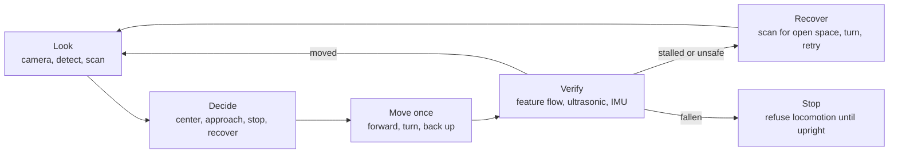
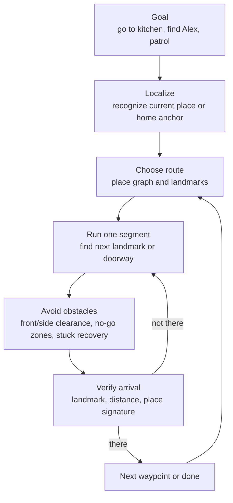
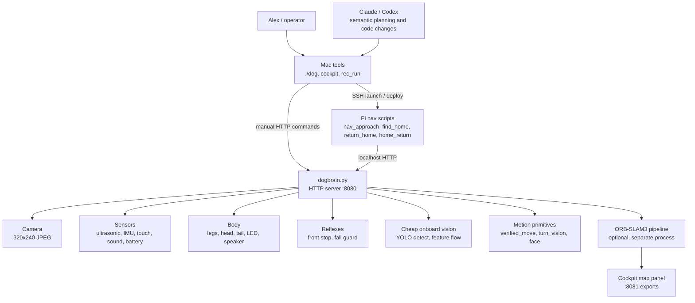
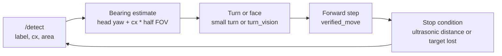
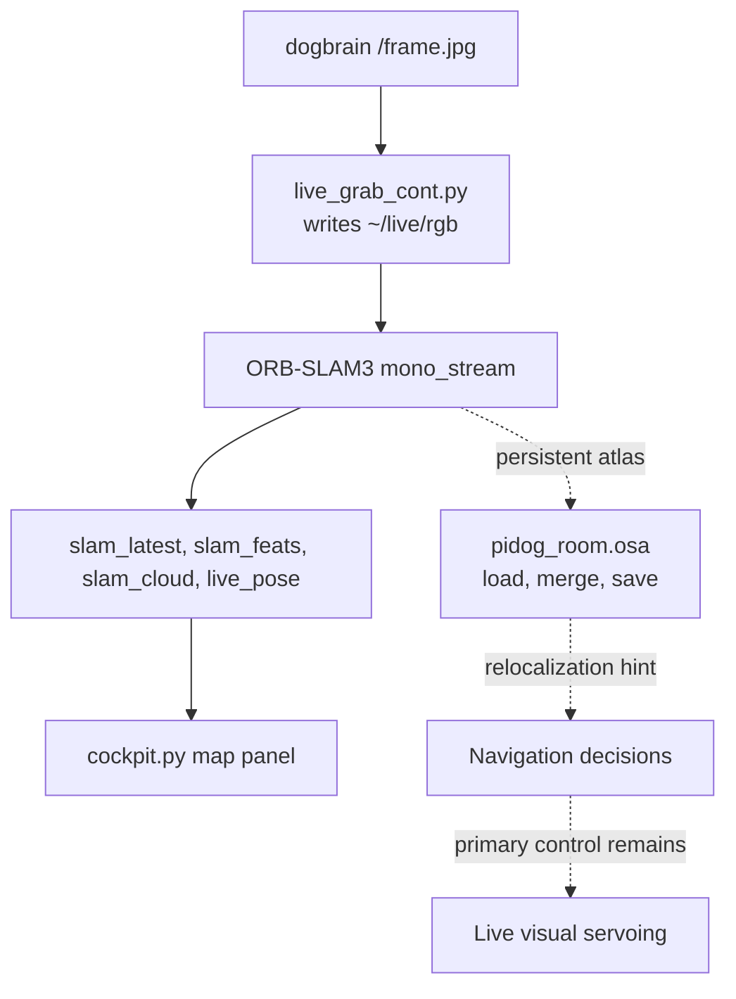
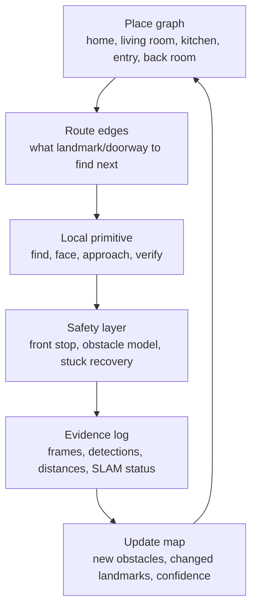

# PiDog Architecture

This document explains what the dog can do today, what is missing, what those
missing pieces unlock, and how the software/hardware pieces fit together.

For the living plan and latest run status, read [STATUS.md](STATUS.md) first.
This file is the architecture and capability map: the machinery, the control
loops, and the gaps.

## Core Idea

PiDog is a small quadruped trying to navigate a real house from its own sensors:
floor-level camera, ultrasonic distance, IMU, touch, sound direction, and battery.

The successful navigation pattern is not metric SLAM-first path planning. It is:

1. Look with the dog's own camera.
2. Detect a landmark or open direction.
3. Make one small movement.
4. Verify the movement with fresh sensor evidence.
5. Re-sense before deciding again.

The dog moves fine when commanded. The hard parts are perception, obstacle
understanding, map memory, battery sag, and correcting drift.

## Capability Map

| Capability | Status | What works | Missing / risk |
|---|---|---|---|
| Manual drive from Mac | Working | `cockpit.py` and `./dog act` can send raw or verified movement commands | Operator must still respect no-go zones and verify with fresh frames |
| Basic movement | Working | Forward/backward/turn gaits execute; forward translates about 8 cm/step | Turn gait drifts; low battery weakens turns |
| Forward obstacle reflex | Partial | `reflex_loop` stops forward motion when ultrasonic sees `<18 cm` | This is not real obstacle detection: only forward, narrow cone, unreliable with soft/cluttered objects, no side/rear awareness, no obstacle map |
| Real obstacle detection | Missing | Stall detection can notice some failures after a move | The dog cannot yet perceive furniture/objects as obstacles, map them, or plan around them |
| Fall safety | Working | IMU detects tip-over and refuses locomotion until upright | It prevents thrashing, but does not self-right |
| Verified movement / stall detection | Working-ish | `verified_move` checks feature flow, ultrasonic delta, and tilt after a gait | Can miss failures on low-texture scenes or bad distance readings |
| Turn by visual motion | Working-ish | `turn_vision` measures scene shift instead of trusting gyro turns | Long/weak turns at low battery; feature flow can fail on blur/blank scenes |
| Face a visible landmark | Working | `face` head-scans for a label, estimates bearing, turns body with `turn_vision` | Depends on YOLO seeing the label reliably |
| Approach visible landmark | Working-ish | `nav_approach.py` centers `cx`, steps forward, stops by ultrasonic | Target must be visible; obstacle handling is primitive |
| Find home landmark | Working | `find_home.py` sweeps until it finds the bookshelf (`book`) and faces it | Fixes orientation, not exact position |
| Return to recorded home position | Partial | `return_home.py` faces bookshelf and matches forward distance | Lateral offset is measured but not corrected |
| Leave and return | Partial | `home_return.py` can leave open floor, turn back, re-acquire bookshelf | Not yet a clean, repeatedly verified round trip; battery sag is a major factor |
| Persistent visual SLAM memory | Partial | ORB-SLAM3 map loads, merges, saves, and can relocalize | Monocular scale weak; loses tracking during turns; not the primary navigator |
| Whole-house map | Missing | Some house-map images/data exist | Needs place graph, route memory, obstacle/no-go modeling, and update logic |
| Whole-house navigation | Missing | Landmark approach and find-home are building blocks | Needs route executor: find place, choose next landmark, travel, verify, recover |
| Find Alex | Missing | Pieces exist: camera frames, YOLO/person-class possibility, sound direction, approach | Needs scan/search behavior, identity confirmation, safe approach, moving-target handling |
| Patrol and report changes | Missing | Recording and map artifacts exist | Needs whole-house map, place revisits, change detection, and report generation |

## What The Dog Can Do Today

The dog can be manually driven, can execute movement commands, can stop forward
motion when the front ultrasonic sensor sees a close object, can detect a fall,
can verify many movements after they finish, can detect COCO objects with
YOLOv4-tiny, can visually steer toward a visible landmark, and can find and face
the home bookshelf.

It can also run a persistent ORB-SLAM3 process that saves and reloads a visual
map. That is valuable memory, but it is not yet reliable enough to be the main
navigation controller.

Real obstacle detection does not work yet. The current obstacle system is a
narrow forward stop reflex plus post-move stall detection. It does not build an
obstacle map, see side/rear hazards, reason about turn clearance in all
directions, or plan around furniture. This is one of the biggest missing pieces
for real whole-house navigation.

## What Is Missing

| Missing piece | Why it matters | Unlocks |
|---|---|---|
| General obstacle perception | The dog must know what it cannot walk into or turn through | Safer autonomy, route execution, whole-house navigation |
| Whole-house place graph | The dog needs remembered places and landmark relationships, not just one home anchor | Kitchen/living room/entry/back-room navigation |
| Route executor | It needs to chain local behaviors into long trips | "Go to kitchen", patrol, return from another room |
| Lateral localization | One wide landmark gives orientation and distance, not side offset | Exact return-home and repeatable docking/home positioning |
| Better search behavior | Targets will not always be in view | Find landmarks, find Alex, recover after getting lost |
| Person/Alex confirmation loop | Seeing "person" is not the same as finding Alex | Honest find-Alex behavior |
| Low-battery turn hardening | Voltage sag makes turns weak and long | Longer autonomous runs without false navigation failures |
| Optional magnetometer | Gyro/vision can re-anchor, but absolute heading would reduce drift | More reliable route memory and coarse whole-house orientation |

## What The Dog Should Be Able To Do After Those Pieces

With general obstacle perception, a place graph, and a route executor, the dog
should be able to navigate the whole house as a sequence of local visual tasks:

The target end state is not "drive by remembered angles." It is repeatable,
sensor-confirmed behavior:

- Go from home to named rooms or landmarks.
- Return home from any known place.
- Patrol known places and report what changed.
- Search for Alex using the dog's own camera and passive sound cues.
- Stop or reroute around obstacles instead of charging blindly.
- Keep claims honest: "I see the bookshelf", "I am near home distance", "I found
  a person-shaped target", not "I found Alex" unless a frame confirms it.

## Control Stack

The architecture has three control layers. The Pi is no longer just a dumb body:
it owns hardware, safety, cheap perception, measured motion, and tight local
loops. The Mac/Claude side owns high-level judgment, orchestration, review, and
development.

## Primary Navigation Method

Primary navigation is visual servoing against live landmarks. The dog does not
trust commanded turn angles or remembered headings as ground truth.

SLAM is a supporting memory system:

SLAM's job is persistent visual memory and relocalization. It is not currently
the safe path planner for moving through the house.

## Component Details

### `dogbrain.py` - Pi Hardware Owner

`dogbrain.py` is the always-on service on the Pi. It owns the SunFounder PiDog
hardware and exposes a multithreaded HTTP server on port `8080`.

Important endpoints:

| Endpoint | Purpose |
|---|---|
| `GET /health` | Liveness check |
| `GET /sense` | Telemetry: distance, IMU, touch, sound, battery, heading, odometry, blocked/fallen flags, RAM |
| `GET /frame.jpg` | Latest onboard camera frame |
| `GET /detect` | YOLOv4-tiny object detections with `label`, `cx`, `area_frac`, confidence |
| `GET /scan` | Head-only yaw sweep with ultrasonic distance and frame per yaw |
| `GET /imu` | High-rate IMU stream for SLAM experiments |
| `GET /battraw` | Battery ADC samples for sag debugging |
| `GET /gyrotest` | Stationary gyro drift test |
| `POST /act` | Command bus for movement, posture, head, LEDs, behavior toggles |

Core onboard routines:

| Routine | What it does | Status |
|---|---|---|
| `reflex_loop` | Stops forward motion if the forward ultrasonic sees `<18 cm`; watches for falls | Partial obstacle safety, working fall guard |
| `behavior_loop` | Optional idle/reactive behavior: glances, tail, touch/sound reactions | Must be disabled for navigation |
| `heading_loop` | Integrates gyro into a heading estimate | Useful telemetry, not navigation truth |
| `imu_sampler` | Buffers IMU samples for `/imu` | Supports SLAM/VIO experiments |
| `verified_move` | Runs a gait, waits for it to settle, checks motion/fall/stall | Working-ish |
| `turn_vision` | Uses camera feature flow to measure real turn amount | Working-ish |
| `face_landmark` | Head-scan for a label, then body-turn toward it | Working when detection is reliable |
| `stop` handling | Sets abort flag and hard-stops outside the action lock | Important safety path |

### `./dog` - Mac CLI Helper

`./dog` is the operator shortcut. It SSHes to the Pi and curls
`localhost:8080`. It supports `sense`, `see`, `perceive`, `scan`, `act`,
`health`, `up`, `quiet`, `approach`, and `unstick`.

`quiet`, `approach`, and `unstick` copy `nav_approach.py` to the Pi and run it
there. This matters because the tight loop then calls `localhost:8080` on the Pi
instead of paying a WiFi hop per control step.

### Navigation Scripts

The navigation scripts are version-controlled on the Mac, but their intended
tight control loops run on the Pi.

| File | Purpose | Current status |
|---|---|---|
| `nav_approach.py` | Disable autonomy, center head, detect target, steer on `cx`, step forward, unstick on stalls | Main working approach primitive |
| `find_home.py` | Sweep with head/body turns until the bookshelf appears, then center it | Working for facing home |
| `record_home.py` | Face bookshelf, scan depth/landmark signature, write `home_signature.json` | Captures a home fingerprint |
| `return_home.py` | Face bookshelf, match recorded forward distance, report depth-profile error | Partial exact-home return |
| `home_return.py` | Leave open floor, turn back, re-acquire bookshelf, report distance error | Partial round-trip test |
| `navigate_return.py` | Older leave-and-return toward-bookshelf routine with SLAM cross-check | Legacy; still has old timeout behavior |

### `cockpit/cockpit.py` - Manual Drive And Debug Dashboard

The cockpit is a Mac-side web dashboard at `http://localhost:8088`.

It shows the onboard camera, telemetry, command latency, recording controls, and
an optional SLAM map panel. It proxies manual drive commands to `dogbrain.py`.
Manual mode sends snappy `verify:false` movement commands and turns off onboard
autonomy; autonomous mode allows the dog's alive/react behavior.

Cockpit recording saves onboard frames, sense snapshots, and action events under
`cockpit_sessions/`. This is separate from `rec_run.py`.

### `rec_run.py` - Run Recorder

`rec_run.py` runs on the Mac and records a run into `runs/<stamp>_<name>/`.
It samples:

- external screen screenshots with `screencapture`, useful when Photo Booth or
  another room-view camera is foregrounded;
- onboard dog frames from `/frame.jpg`;
- selected telemetry from `/sense`.

It stitches `ext.mp4` and `dog.mp4` with `ffmpeg` and writes `data.jsonl` plus
`run.log`. Published clips live in `recordings/`.

### SLAM Pipeline

The SLAM pipeline is optional and separate from the always-on `dogbrain.py`
server.

| Piece | Role |
|---|---|
| `slam/live_grab_cont.py` | Pulls frames from `localhost:8080/frame.jpg` into `~/live/rgb` |
| `slam/mono_stream.cc` | ORB-SLAM3 monocular node, follows the frame folder |
| `slam/pidog_mono.yaml` | Camera/ORB settings and persistent atlas config |
| `slam/slam_live.sh` | Starts grabber, SLAM node, and static server |
| `slam/slam_stop.sh` | Stops the pipeline, allowing atlas save |
| `slam/System.cc.patched` | ORB-SLAM3 shutdown/save fix |
| `slam/mono_stream_imu.cc` and related IMU files | Mono-inertial experiment, currently unused because IMU init NaN-crashes |

Current SLAM truth:

- Monocular SLAM can track, build, load, merge, and save a persistent atlas.
- It often loses tracking during turns.
- Relocalization is useful but intermittent.
- Scale is not trustworthy enough for whole-house metric path planning.
- It should support place memory, not replace live visual servoing.

## Data And Memory Artifacts

| Artifact | Purpose |
|---|---|
| `home_signature.json` | Recorded home-facing-bookshelf distance, depth profile, and landmark sightings |
| `house_map.json` | Early persistent house/place map artifact |
| `house_map/` | Reference images by place |
| `recordings/` | Published run videos |
| `runs/` | Local recorder output, gitignored |
| `cockpit_sessions/` | Cockpit recordings, gitignored |

## Whole-House Navigation Target

The system still needs to grow from "local landmark servoing" to "whole-house
navigation." The likely architecture is a place graph layered above the existing
local primitives.

This is the missing bridge between the current robot and the desired robot.
Once it exists, high-level commands become possible:

- "Go to the kitchen."
- "Return home."
- "Patrol the known rooms."
- "Find Alex."
- "Tell me what changed."

Each command should decompose into known-place recognition, route selection,
one local movement segment, verification, and recovery. The dog should never
claim success without fresh sensor or frame evidence.

## Design Rules

1. Navigate by live vision, not remembered angles.
2. Disable alive/react autonomy before navigation so the head does not corrupt
   landmark bearings.
3. Treat obstacle detection as missing. Forward ultrasonic stop is a reflex, not
   a world model.
4. Keep the laptop/home-base side as a no-go zone.
5. Use SLAM as persistent memory and relocalization support, not as the primary
   path planner yet.
6. Verify motion with fresh evidence. If two movements do not match prediction,
   stop and diagnose.
7. Be honest in language: report what sensors confirmed, not what we hoped
   happened.
