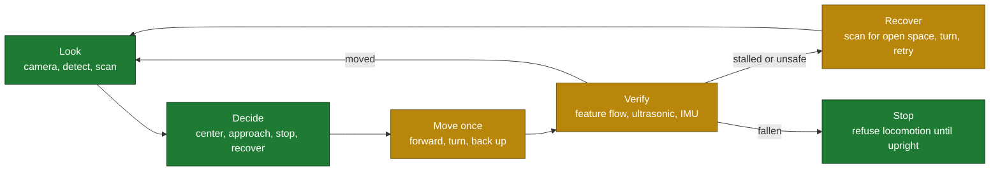
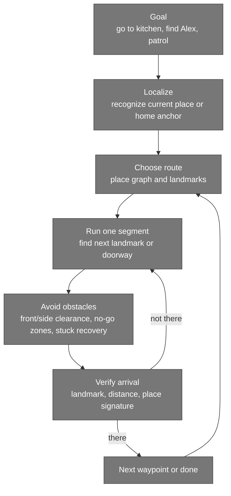
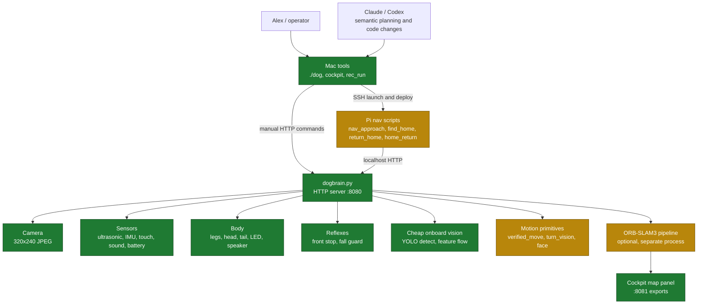
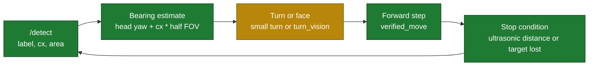
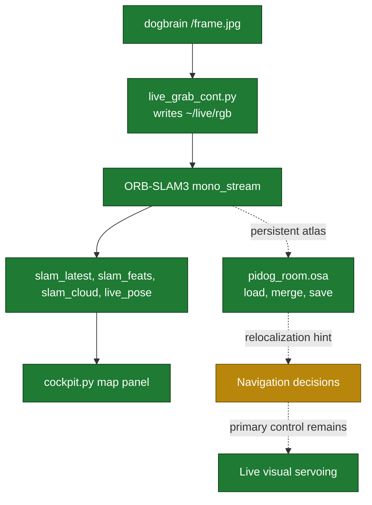
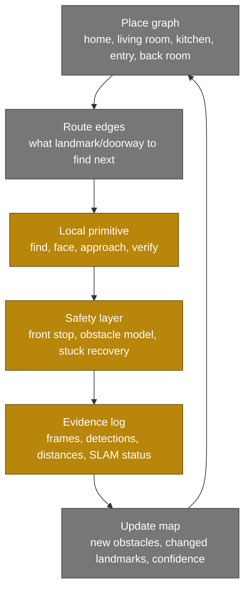

# PiDog Architecture

This document explains what the dog can do today, what is missing, what those
missing pieces unlock, and how the software/hardware pieces fit together.

For the living plan and latest run status, read [STATUS.md](STATUS.md) first.
This file is the architecture and capability map: the machinery, the control
loops, and the gaps.

## Core Idea

PiDog is a small quadruped trying to navigate a real house from its own sensors:
floor-level camera, ultrasonic distance, IMU, touch, sound direction, and battery.

The successful navigation pattern is not metric SLAM-first path planning. It is:

1. Look with the dog's own camera.
2. Detect a landmark or open direction.
3. Make one small movement.
4. Verify the movement with fresh sensor evidence.
5. Re-sense before deciding again.

The dog moves fine when commanded. The hard parts are perception, obstacle
understanding, map memory, battery sag, and correcting drift.

## Status Legend

Color shows how strongly each capability is **proven**, not just whether code exists:

| Badge | Meaning |
|---|---|
| 🟢 **Proven** | verified by an actual test, with a recorded result / proof |
| 🟡 **Working-ish** | observed to work, but flaky, partial, or only under some conditions |
| 🟠 **Assumed** | believed to work from reading the code, but **not** actually tested |
| 🔴 **Not working** | tried; does not achieve the goal yet |
| ⚪ **Not implemented** | does not exist yet |

The **Evidence / action** column cites the real test behind a 🟢, or the concrete action needed to
turn a non-green row green. The diagrams below use the same colors (green = proven … grey = not built).

## Capability Map

| Capability | Status | What works | Gap / risk | Evidence — test, result, proof (or action to reach 🟢) |
|---|---|---|---|---|
| Manual drive from Mac | 🟢 Proven | `cockpit.py` + `./dog act` send raw/verified commands | Operator must still respect no-go zones | Cockpit `/act` round-trip measured **~20 ms** after the IPv4 fix; driven live via the cockpit |
| Basic movement (gaits) | 🟢 Proven | Forward/turn gaits execute; forward ≈ 8 cm/step | Turn gait drifts sideways; backward is weak | Verified forward step measured **−8.2 cm** ultrasonic + 24.5 px flow; earlier 139→131 cm ≈ 8 cm/step |
| Forward obstacle reflex (<18 cm) | 🟡 Working-ish | `reflex_loop` stops forward motion under 18 cm | Forward narrow cone only; soft/cluttered objects unreliable; no side/rear | Telemetry shows it firing: `last_reflex {obstacle, 16.31 cm}`, `reflex_count 7`. Action: widen into a real obstacle model |
| Real obstacle detection | ⚪ Not implemented | — | Cannot perceive / map / avoid furniture | Action: build an occupancy/obstacle model from depth-scan + camera, with side/rear awareness |
| Fall safety | 🟢 Proven | IMU tip-over → refuses locomotion until upright | Does not self-right | `journalctl`: `FALL detected -> fallen=True` fired on a real tip-over; IMU showed gravity on the Z axis; locomotion refused |
| Verified move / stall detection | 🟡 Working-ish | `verified_move` checks flow + ultrasonic + tilt | **Missed a real wedge** (leg-shuffle jitter read as motion) | Forward → `moved:true` (24.5 px, −8.2 cm) ✓, but failed to flag a real stuck. Action: detect stall by **gyro heading-delta**, not camera flow; re-test vs a known wedge |
| Turn by visual motion (`turn_vision`) | 🟡 Working-ish | Measures real rotation from scene shift, not gyro | Under-rotates at low battery; slow | Calibrated on the external cam: **cmd 90° → ~90° actual** (gyro gave ~30°). Action: low-battery turn hardening; re-validate measured-vs-actual across charge levels |
| Face a visible landmark (`face`) | 🟠 Assumed | Head-scan bearing → body turn via `turn_vision` | Standalone command didn't converge in test | `face book` test **stuck at ~64° after 44 s** (never centered); the mechanism works inside `find_home`. Action: re-test `face` to clean convergence on a charged pack; record |
| Approach a landmark (`nav_approach`) | 🟢 Proven | Centers `cx`, steps forward, stops on ultrasonic; unsticks on stall | YOLO flickers at range | Recorded run **184 → 61 cm**, kept the bookshelf centered (cx≈0), no false stalls |
| Find home landmark (`find_home`) | 🟢 Proven | Sweeps, detects `book`, faces it | Fixes **orientation only**, not position | Found the shelf on sweep 0 and centered to **cx −0.07** @ ~107 cm; recorded `find_home_onboard.mp4` |
| Return to exact home **position** (`return_home`) | 🔴 Not working | Faces bookshelf + matches forward distance | **Lateral position is wrong** | Test: distance 65 vs 75 cm ✓ but **depth-profile error 112 cm** — ended at a different spot (furniture 14 cm left vs open at home). Action: 2nd landmark to triangulate / scan-matching / live SLAM relocalization |
| Leave and return (`home_return`) | 🔴 Not working | Physically leaves, turns back, re-acquires shelf | Not a clean verified round-trip | Runs degraded by battery sag (turns timed out, walks cut short); never a clean round-trip. Action: full charge + turn hardening + fix `navigate_return` timeout; record a clean round-trip |
| Persistent SLAM memory | 🟢 Proven (memory) / 🟡 (as navigator) | Atlas load→merge→save; relocalizes | Loses tracking in turns; not the path planner | **Proven**: `*Merge detected/finished`, osa grew 1.09→1.92 MB, relocalized — without gdb. Not yet usable as a navigator |
| Whole-house map | ⚪ Not implemented | `house_map/` has reference images only | No place graph / route memory | Action: build a landmark place-graph + obstacle/no-go layer with update logic |
| Whole-house navigation | ⚪ Not implemented | Approach + find-home are building blocks | No route executor | Action: route executor — find place → choose next landmark → travel → verify → recover |
| Find Alex | ⚪ Not implemented | Camera, person-class, sound direction exist | No search/confirm/approach loop | Action: scan-search behavior + identity confirmation (frame) + safe moving-target approach |
| Patrol & report changes | ⚪ Not implemented | Recorder + map images exist | No revisit / change detection | Action: whole-house map + place revisits + change detection + report generation |

## What The Dog Can Do Today

The dog can be manually driven, can execute movement commands, can stop forward
motion when the front ultrasonic sensor sees a close object, can detect a fall,
can verify many movements after they finish, can detect COCO objects with
YOLOv4-tiny, can visually steer toward a visible landmark, and can find and face
the home bookshelf.

It can also run a persistent ORB-SLAM3 process that saves and reloads a visual
map. That is valuable memory, but it is not yet reliable enough to be the main
navigation controller.

Real obstacle detection does not work yet. The current obstacle system is a
narrow forward stop reflex plus post-move stall detection. It does not build an
obstacle map, see side/rear hazards, reason about turn clearance in all
directions, or plan around furniture. This is one of the biggest missing pieces
for real whole-house navigation.

## What Is Missing

| Missing piece | Why it matters | Unlocks |
|---|---|---|
| General obstacle perception | The dog must know what it cannot walk into or turn through | Safer autonomy, route execution, whole-house navigation |
| Whole-house place graph | The dog needs remembered places and landmark relationships, not just one home anchor | Kitchen/living room/entry/back-room navigation |
| Route executor | It needs to chain local behaviors into long trips | "Go to kitchen", patrol, return from another room |
| Lateral localization | One wide landmark gives orientation and distance, not side offset | Exact return-home and repeatable docking/home positioning |
| Better search behavior | Targets will not always be in view | Find landmarks, find Alex, recover after getting lost |
| Person/Alex confirmation loop | Seeing "person" is not the same as finding Alex | Honest find-Alex behavior |
| Low-battery turn hardening | Voltage sag makes turns weak and long | Longer autonomous runs without false navigation failures |
| Optional magnetometer | Gyro/vision can re-anchor, but absolute heading would reduce drift | More reliable route memory and coarse whole-house orientation |

## What The Dog Should Be Able To Do After Those Pieces

With general obstacle perception, a place graph, and a route executor, the dog
should be able to navigate the whole house as a sequence of local visual tasks:

The target end state is not "drive by remembered angles." It is repeatable,
sensor-confirmed behavior:

- Go from home to named rooms or landmarks.
- Return home from any known place.
- Patrol known places and report what changed.
- Search for Alex using the dog's own camera and passive sound cues.
- Stop or reroute around obstacles instead of charging blindly.
- Keep claims honest: "I see the bookshelf", "I am near home distance", "I found
  a person-shaped target", not "I found Alex" unless a frame confirms it.

## Control Stack

The architecture has three control layers. The Pi is no longer just a dumb body:
it owns hardware, safety, cheap perception, measured motion, and tight local
loops. The Mac/Claude side owns high-level judgment, orchestration, review, and
development.

## Primary Navigation Method

Primary navigation is visual servoing against live landmarks. The dog does not
trust commanded turn angles or remembered headings as ground truth.

SLAM is a supporting memory system:

SLAM's job is persistent visual memory and relocalization. It is not currently
the safe path planner for moving through the house.

## Component Details

### `dogbrain.py` - Pi Hardware Owner

`dogbrain.py` is the always-on service on the Pi. It owns the SunFounder PiDog
hardware and exposes a multithreaded HTTP server on port `8080`.

Important endpoints:

| Endpoint | Purpose |
|---|---|
| `GET /health` | Liveness check |
| `GET /sense` | Telemetry: distance, IMU, touch, sound, battery, heading, odometry, blocked/fallen flags, RAM |
| `GET /frame.jpg` | Latest onboard camera frame |
| `GET /detect` | YOLOv4-tiny object detections with `label`, `cx`, `area_frac`, confidence |
| `GET /scan` | Head-only yaw sweep with ultrasonic distance and frame per yaw |
| `GET /imu` | High-rate IMU stream for SLAM experiments |
| `GET /battraw` | Battery ADC samples for sag debugging |
| `GET /gyrotest` | Stationary gyro drift test |
| `POST /act` | Command bus for movement, posture, head, LEDs, behavior toggles |

Core onboard routines:

| Routine | What it does | Status |
|---|---|---|
| `reflex_loop` | Stops forward motion if the forward ultrasonic sees `<18 cm`; watches for falls | Partial obstacle safety, working fall guard |
| `behavior_loop` | Optional idle/reactive behavior: glances, tail, touch/sound reactions | Must be disabled for navigation |
| `heading_loop` | Integrates gyro into a heading estimate | Useful telemetry, not navigation truth |
| `imu_sampler` | Buffers IMU samples for `/imu` | Supports SLAM/VIO experiments |
| `verified_move` | Runs a gait, **waits for it to settle**, then checks motion (feature-flow + ultrasonic delta) + IMU tilt to flag stall/fall | 🟡 Working-ish (missed a real wedge once) |
| `turn_vision` | Turns a batch of steps at a time and measures the **real rotation** from camera feature-flow (gyro under-reports ~3×), accumulating to the target. If a batch shows **no scene shift = wedged → it backs up to make clearance and retries (≤3×)**, then stops and waits for input | 🟡 Working-ish (under-rotates at low battery) |
| `face_landmark` | **Head-scan loop** (fast, no body drift): pans the head across a few yaws, computes each landmark's bearing `= head_yaw + cx·half-FOV`, picks the best sighting, then turns the body to it via `turn_vision`; repeats until centered | 🟠 Assumed (standalone `face` test didn't converge) |
| `stop` handling | Sets the **abort flag** and hard-stops **outside the action lock**, so it interrupts a running routine instead of queuing behind it | 🟢 Proven (interrupted a turn in ~2 ms) |

### `./dog` - Mac CLI Helper

`./dog` is the operator shortcut. It SSHes to the Pi and curls
`localhost:8080`. It supports `sense`, `see`, `perceive`, `scan`, `act`,
`health`, `up`, `quiet`, `approach`, and `unstick`.

`quiet`, `approach`, and `unstick` copy `nav_approach.py` to the Pi and run it
there. This matters because the tight loop then calls `localhost:8080` on the Pi
instead of paying a WiFi hop per control step.

### Navigation Scripts

The navigation scripts are version-controlled on the Mac, but their intended
tight control loops run on the Pi.

| File | Purpose | Current status |
|---|---|---|
| `nav_approach.py` | Disable autonomy, center head, detect target, steer on `cx`, step forward, unstick on stalls | Main working approach primitive |
| `find_home.py` | Sweep with head/body turns until the bookshelf appears, then center it | Working for facing home |
| `record_home.py` | Face bookshelf, scan depth/landmark signature, write `home_signature.json` | Captures a home fingerprint |
| `return_home.py` | Face bookshelf, match recorded forward distance, report depth-profile error | Partial exact-home return |
| `home_return.py` | Leave open floor, turn back, re-acquire bookshelf, report distance error | Partial round-trip test |
| `navigate_return.py` | Older leave-and-return toward-bookshelf routine with SLAM cross-check | Legacy; still has old timeout behavior |

### `cockpit/cockpit.py` - Manual Drive And Debug Dashboard

The cockpit is a Mac-side web dashboard at `http://localhost:8088`.

It shows the onboard camera, telemetry, command latency, recording controls, and
an optional SLAM map panel. It proxies manual drive commands to `dogbrain.py`.
Manual mode sends snappy `verify:false` movement commands and turns off onboard
autonomy; autonomous mode allows the dog's alive/react behavior.

Cockpit recording saves onboard frames, sense snapshots, and action events under
`cockpit_sessions/`. This is separate from `rec_run.py`.

### `rec_run.py` - Run Recorder

`rec_run.py` runs on the Mac and records a run into `runs/<stamp>_<name>/`.
It samples:

- onboard dog frames from `/frame.jpg` — the reliable stream (this is the real recording);
- selected telemetry from `/sense`;
- external screen screenshots via `screencapture` — **does not actually work in this sandbox**:
  the shell can only capture the **desktop, not the Photo Booth window** (macOS runs them on
  separate Spaces), so `ext.mp4` is the desktop, not a room view. The external/room view is
  instead delivered as inline computer-use screenshots, not via `rec_run`.

It stitches `dog.mp4` (good) and `ext.mp4` (currently the desktop) with `ffmpeg` and writes
`data.jsonl` plus `run.log`. Published onboard clips live in `recordings/`.

### SLAM Pipeline

The SLAM pipeline is optional and separate from the always-on `dogbrain.py`
server.

| Piece | Role |
|---|---|
| `slam/live_grab_cont.py` | Pulls frames from `localhost:8080/frame.jpg` into `~/live/rgb` |
| `slam/mono_stream.cc` | ORB-SLAM3 monocular node, follows the frame folder |
| `slam/pidog_mono.yaml` | Camera/ORB settings and persistent atlas config |
| `slam/slam_live.sh` | Starts grabber, SLAM node, and static server |
| `slam/slam_stop.sh` | Stops the pipeline, allowing atlas save |
| `slam/System.cc.patched` | ORB-SLAM3 shutdown/save fix |
| `slam/mono_stream_imu.cc` and related IMU files | Mono-inertial experiment, currently unused because IMU init NaN-crashes |

Current SLAM truth:

- Monocular SLAM can track, build, load, merge, and save a persistent atlas.
- It often loses tracking during turns.
- Relocalization is useful but intermittent.
- Scale is not trustworthy enough for whole-house metric path planning.
- It should support place memory, not replace live visual servoing.

## Data And Memory Artifacts

| Artifact | Purpose |
|---|---|
| `home_signature.json` | Recorded home-facing-bookshelf distance, depth profile, and landmark sightings |
| `house_map.json` | Early persistent house/place map artifact |
| `house_map/` | Reference images by place |
| `recordings/` | Published run videos |
| `runs/` | Local recorder output, gitignored |
| `cockpit_sessions/` | Cockpit recordings, gitignored |

## Whole-House Navigation Target

The system still needs to grow from "local landmark servoing" to "whole-house
navigation." The likely architecture is a place graph layered above the existing
local primitives.

This is the missing bridge between the current robot and the desired robot.
Once it exists, high-level commands become possible:

- "Go to the kitchen."
- "Return home."
- "Patrol the known rooms."
- "Find Alex."
- "Tell me what changed."

Each command should decompose into known-place recognition, route selection,
one local movement segment, verification, and recovery. The dog should never
claim success without fresh sensor or frame evidence.

## Design Rules

1. Navigate by live vision, not remembered angles.
2. Disable alive/react autonomy before navigation so the head does not corrupt
   landmark bearings.
3. Treat obstacle detection as missing. Forward ultrasonic stop is a reflex, not
   a world model.
4. Keep the laptop/home-base side as a no-go zone.
5. Use SLAM as persistent memory and relocalization support, not as the primary
   path planner yet.
6. Verify motion with fresh evidence. If two movements do not match prediction,
   stop and diagnose.
7. Be honest in language: report what sensors confirmed, not what we hoped
   happened.
