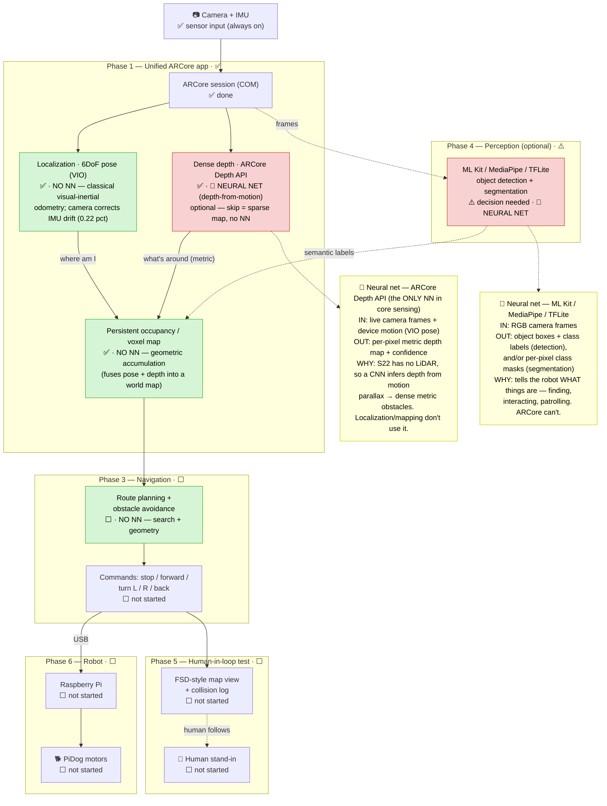
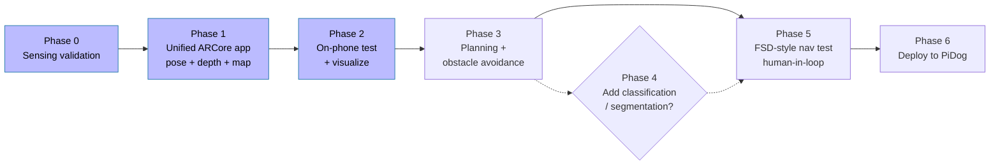

# Pidog Spatial-AI Project Plan

**Goal:** A Samsung Galaxy S22 acts as the "brain + sensors" for a PiDog robot (S22 → Raspberry Pi over USB). The phone maps the house, localizes within it, detects obstacles and depth, plans routes, avoids obstacles, and (later) recognizes/classifies objects — to autonomously navigate, patrol, find things, and interact.

**Strategy:** Build the whole stack on the **phone first**, validating each capability with a human standing in for the dog (follow on-screen commands, log collisions). Only deploy to the PiDog once it works on the phone.

**Device facts:** S22 = Snapdragon/Exynos, **no LiDAR/ToF** → depth comes from ARCore depth-from-motion. ARCore is well supported on this device. iPhone-15 RTAB-Map experience (no LiDAR either) set the quality bar; tracking is expected to transfer.

---

## Target system architecture

One ARCore app on the phone is the brain: it reads **pose + depth** straight from the ARCore SDK (the two things RTAB-Map and 3D Live Scanner each withhold), builds a persistent map, plans/avoids, and emits movement commands — first to a human stand-in, later to the PiDog.

Blocks are **grouped by the phase that builds them** and tagged with **status** (✅/🔄/⬜/⚠️). Color = neural-net usage: **green = no NN** (classical geometry/search), **red = NN**. Yellow notes give each net's **inputs → outputs → why**. Note that **localization and mapping use no NN** — the *only* net in core sensing is the Depth API, and it's optional (skip it and the map is just sparse).

---

## Status legend
✅ done · 🔄 in progress · ⬜ not started · ⚠️ blocked/decision needed

---

## Roadmap at a glance

---

## Phase 0 — Sensing validation (✅ DONE, 2026-06-19)

**Question:** Can the S22 + ARCore actually track, map, and produce depth well enough? Which existing app, if any, gives localization + loop closure + dense depth + obstacles?

**Method:** Installed three open-source apps via wireless adb. Walked the **same route** capturing with RTAB-Map (×3) and 3D Live Scanner (×2). Pulled the raw files to Mac and reverse-engineered them (`tools/` scripts).

### Results

| Capture | Nodes/verts | Localization | Loop closure | Dense depth saved | Obstacles/occupancy | Trajectory accessible |
|---|---|---|---|---|---|---|
| RTAB-Map `083419` | 104 nodes | ✅ | 7 global | ❌ `depth=0` | ❌ `obstacle_cells=0` | ✅ (pose graph) |
| RTAB-Map `084330` | 90 nodes | ✅ | 5 global | ❌ | ❌ | ✅ |
| RTAB-Map `091312` (route) | 262 nodes | ✅ | **9 global** | ❌ `depth=0` | ❌ | ✅ |
| 3D Live Scanner `084038` | 245,922 verts | ❌ not exposed | ❌ none | ✅ dense mesh | (implicit in mesh) | ❌ paywalled |
| 3D Live Scanner `092541` (route) | 187,306 verts / 270,076 faces | ❌ | ❌ | ✅ dense mesh | (implicit) | ❌ |

### Key conclusions
1. **ARCore tracking on the S22 is solid.** RTAB-Map (which runs *on* ARCore) held tracking over 14 m with no loss and produced 5–9 real appearance-based **loop closures** — the globally-consistent localization we need. ARCore also has its own internal drift correction ("Concurrent Odometry and Mapping"), which is why 3DLS tracking felt good too.
2. **No single app gives us everything:**
   - **RTAB-Map** = excellent **localization + loop closure**, but **does not persist depth or occupancy** in these captures (only RGB + sparse feature scans + a decimated assembled cloud). Sparse map = the user's stated concern, confirmed.
   - **3D Live Scanner** = **dense depth-derived mesh**, but **poses/trajectory are paywalled** (the "Capture a dataset" feature) and there's no loop closure.
3. **The thing that withholds data from us — pose (3DLS) and depth (RTAB-Map) — ARCore exposes BOTH directly** via its SDK (camera pose + Depth API) in one session, with no paywall and full control.

### ⚠️ Architecture decision (resolved by Phase 0)
**Build our own ARCore app** that reads **pose + Depth API together**, rather than (a) modifying RTAB-Map's 5,000-line C++ to save depth, or (b) paying/hacking 3DLS for poses. Pull *techniques/reference* from both, but the app is ours.
- **Localization + depth + obstacles**: directly from ARCore in our app (Path A).
- **Loop closure / global map consistency**: start without it (ARCore's internal correction is decent at room scale); add a lightweight loop-closure step or integrate RTAB-Map as a *library* later **if** drift proves to matter at house scale (Phase 3 decision).

### Artifacts (on disk)
- `scans/rtabmap/*.db` (raw), `*_cloud.ply` / `*_mesh.ply` (extracted, open in CloudCompare/MeshLab), `*_preview.png`, `trajectories.png`
- `scans/3dlivescanner/route_092541/*.obj` (dense textured mesh)
- `tools/` — extraction/analysis scripts; `tools/platform-tools/adb` (wireless link to phone)

---

## Phase 1 — Unified capture app (✅ DONE, 2026-06-19)

📄 **Build details: [PHASE1.md](PHASE1.md)** — fork source, per-repo sourcing, data-to-Mac flow, build environment.

Built `phone_brain/` (Java, forked from `raw_depth_java`), running on the S22:
- [x] ARCore session: 6DoF **pose** stream (localization)
- [x] **Raw Depth API**: per-frame metric depth, confidence-filtered
- [x] `MapAccumulator`: depth+pose → **world-frame voxel map** (5 cm)
- [x] `PoseLogger` + `PlyExporter`: save `trajectory.json` + `map.ply`
- [x] **START/STOP recording** (clean origin) + on-screen save confirmation
- [x] Mac-side `tools/analyze_trajectory.py`: path length + drift + plot

### Result (closed-loop walk)
| metric | value |
|---|---|
| path length | 35.5 m |
| end-to-start gap | **7.8 cm** |
| **drift** | **0.22 %** |
| map | 89k voxels, dense room core |

### ⚠️ Decision resolved: **no loop closure needed**
0.22 % drift is far under the 1–2 % threshold → raw ARCore VIO is accurate enough at room/house scale. We build on **plain ARCore (our own app)** and do **not** integrate RTAB-Map/`librtabmap`. (Re-evaluate only if larger multi-room loops show real drift.)

## Phase 2 — On-phone test + visualization (✅ DONE, 2026-06-19)

Confirmed Phase 1 produces correct localization, depth, and map via a closed-loop walk on the S22.
- [x] Live on-phone view of the map building + current pose (+ live REC/voxel/pose counter)
- [x] Pull data to Mac; visualize/verify trajectory + voxel map (`tools/analyze_trajectory.py`, PLY viz)
- [x] Acceptance met: map metric & dense (89k voxels, recognizable furniture/walls); pose stable over the loop (**0.22 % drift**)
- *Open polish (non-blocking):* outlier filtering on the cloud; per-frame depth dump for any future offline use.

## Phase 3 — Navigation & obstacle avoidance (⬜, + minimal Phase 5)

📄 **Build plan: [PHASE3.md](PHASE3.md)** — v1 scope, new components, the 6-increment breakdown, and the deferred cross-session relocalization test.

**v1 = single-session** (map + navigate in one run). Free-roam mapping + autosave, then the app plans on the 2D occupancy grid and drives a human "dog" to a goal in an FSD-style view. Built together with a minimal slice of Phase 5 (commands + view) so it's testable.
- [ ] **Inc 1:** 2D occupancy grid + FSD map view (voxels → top-down free/occupied/unknown + ego pose)
- [ ] **Inc 2:** continual autosave
- [ ] **Inc 3:** mover interface (instruction banner + AR heading arrow, manual goal)
- [ ] **Inc 4:** A\* path planning to a goal
- [ ] **Inc 5:** **autonomous (frontier) exploration** — app drives the mover to map the area on its own
- [ ] **Inc 6:** reactive obstacle avoidance + COLLISION log
- [ ] **Inc 7:** go-to mode (SET WAYPOINT + RETURN)
- [ ] **Deferred (v2):** cross-session **relocalization** — RTAB-Map test done (~30 cm, slow); next test = **Cloud Anchors in our app + a quantitative error harness** (see PHASE3.md). Loop closure confirmed *not* needed (0.22 % drift).

## Phase 4 — Object classification & segmentation (⚠️ decision)

Needed later for finding things, interacting, patrolling, and "knowing what is what" while navigating.
- **Note:** ARCore does **not** do general indoor object classification/segmentation. Its *Scene Semantics* API is outdoor-oriented (sky/road/building). For indoor we'd add **ML Kit** (object detection, image labeling), **MediaPipe**, or a **TFLite** segmentation model — all native Android, composable with the ARCore app.
- [ ] Decide scope: detection/labeling (cheap) vs. full semantic segmentation (heavier)
- [ ] Decide build: off-the-shelf models vs. fine-tuning (defer training unless clearly needed)
- [ ] Fuse labels into the map (semantic voxels / object anchors)

## Phase 5 — Navigation test ("FSD-style" human-in-the-loop) (⬜)

Turn it into a navigation app the human operator follows as the "dog."
- [ ] Rendered map view (Tesla-FSD-style): map + ego pose + planned path + detected obstacles (+ object labels if Phase 4)
- [ ] Command output: **Stop / Forward / Turn L / Turn R / Back up**
- [ ] **Collision-log button** (operator taps when they hit something) + run logging (pose, command, events)
- [ ] Run the route(s); analyze logs for collisions/failures
- [ ] Iterate: tune, debug, possibly fine-tune/train models (avoid training if disproportionate)

## Phase 6 — Deploy to PiDog (⬜)

- [ ] S22 → Pi over USB; Pi relays motor commands
- [ ] Integrate brain (phone) ↔ body (Pi/PiDog)
- [ ] Re-run navigation/collision tests on the real robot; iterate

---

## Open decisions tracker
- ✅ **P1 (resolved):** own lightweight mapping — built `phone_brain` on plain ARCore; no `librtabmap`.
- ✅ **P3 loop closure (resolved):** not needed — 0.22 % drift on a 35 m loop is well under threshold.
- ✅ **P3 scope (resolved):** v1 = single-session navigate-while-mapping. Cross-session relocalization deferred to v2 — test plan in [PHASE3.md](PHASE3.md).
- ✅ **P3 + P5 coupling (resolved):** build the planner with a minimal FSD-style command view so it's testable (see PHASE3.md increments).
- ⚠️ **Relocalization backend (open):** Cloud Anchors vs on-device ORB vs RTAB-Map — decide after the Cloud Anchors quantitative test (deferred).
- ⚠️ **P4:** classification scope + off-the-shelf vs. trained models.
- **Control location:** phone-brain vs. phone-maps/Pi-plans split (revisit at Phase 6).

## Changelog
- **2026-06-19:** Created plan. Completed Phase 0 (sensing validation) — see results above. Resolved core architecture decision: build our own ARCore app reading pose + depth, since neither RTAB-Map (no saved depth/obstacles) nor 3D Live Scanner (no accessible poses) provides the full set.
- **2026-06-19:** Completed Phase 1 — `phone_brain/` ARCore capture app built + running on the S22 (START/STOP recording, voxel map + trajectory export, on-screen save confirm). Closed-loop walk measured **0.22 % drift** → resolved that **loop closure is not needed**; staying on plain ARCore (no RTAB-Map).
